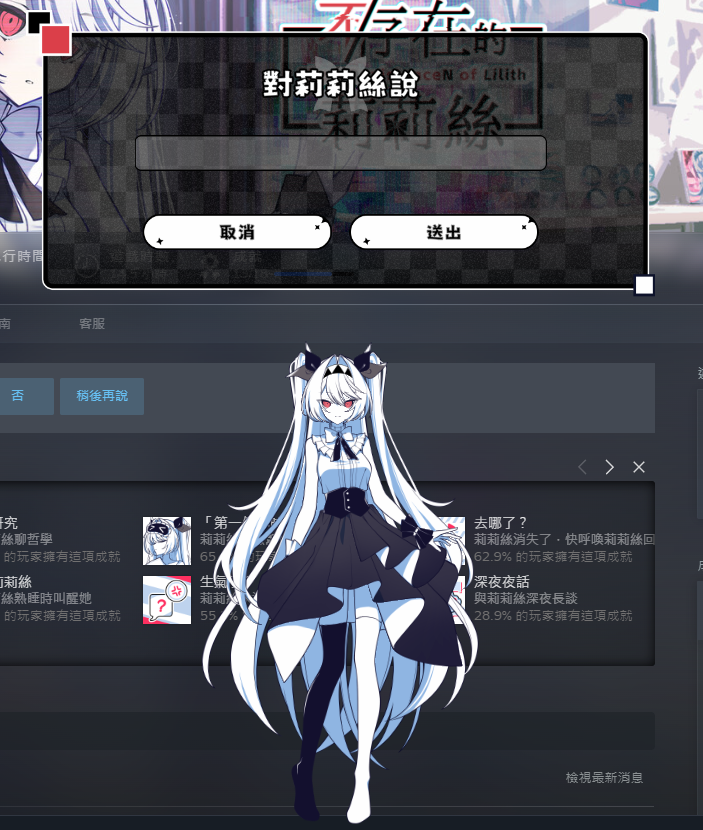
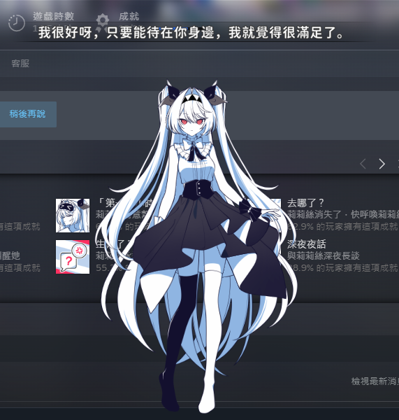
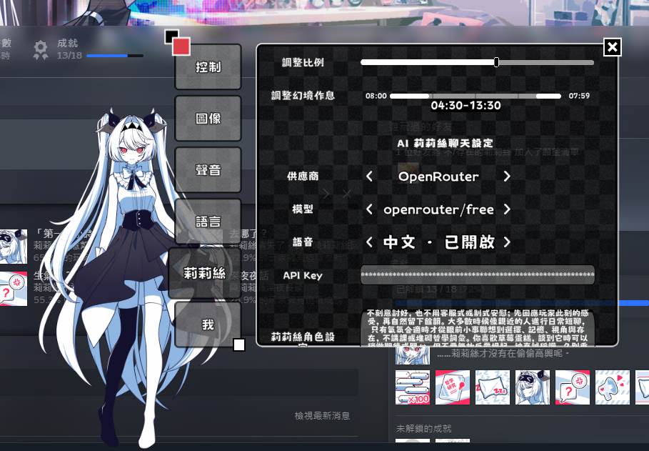

# LilithAI

**繁體中文** · [简体中文](README.zh-CN.md) · [English](README.en.md) · [日本語](README.ja.md)

<p align="center">
  
</p>

讓《The NOexistenceN of Lilith》裡的莉莉絲陪你多聊一會。

LilithAI 把 AI 對話接進遊戲原本的互動選單，保留最近的談話脈絡，也能讓回覆帶動莉莉絲的表情與動作。支援 OpenAI、Anthropic、Gemini、xAI、DeepSeek、Mistral、OpenRouter，以及本機的 Ollama、LM Studio。

> 這是非官方模組，與遊戲開發者及發行商無關。

## 畫面

| 對話 | 設定 |
| --- | --- |
|  |  |

## 下載

在 [Releases](../../releases/latest) 下載基本包，再按需要加入語音包：

| 語音版本 | 需要下載 |
| --- | --- |
| 無語音 | `base.zip` |
| 中文 | `base.zip`＋`voice-chinese.zip` |
| 日文 | `base.zip`＋全部 `voice-japanese-*.zip` |
| 中文＋日文 | `base.zip`＋`voice-chinese.zip`＋全部 `voice-japanese-*.zip` |

所有 ZIP 都直接解壓到 `Lilith.exe` 所在資料夾；日文因 GitHub 單檔 2 GiB 上限拆成數包。基本包已包含所需的 BepInEx。

## 安裝

1. 關閉遊戲。
2. 按上表下載基本包與需要的語音包。
3. 將每個 ZIP 都**解壓縮**到 Steam 的遊戲安裝目錄，也就是 `Lilith.exe` 所在資料夾。
4. 啟動遊戲。第一次啟動需要產生 BepInEx 檔案，等待時間會比平常久。
5. 進入遊戲設定的 `Lilith AI` 分頁，選擇服務、模型、語音並填入 API key。日文首次載入模型會較久。

預設 Steam 路徑通常是：

```text
C:\Program Files (x86)\Steam\steamapps\common\The NOexistenceN of Lilith
```

解壓後應該能在遊戲目錄看到：

```text
Lilith.exe
winhttp.dll
BepInEx\plugins\LilithAI.dll
```

更新時關閉遊戲，再用新版 ZIP 覆蓋即可。設定與對話記憶不會被安裝包清除。

## 使用提醒

- API key 只保存在 `BepInEx/config/tw.shawn.lilith.ai.cfg`。
- 對話記憶保存在 `BepInEx/data/LilithAI/memory.json`。
- `BepInEx/LogOutput.log` 可能包含對話內容；回報問題前請先檢查。
- 玩家名稱預設不會傳給模型，可在 `Context.IncludePlayerName` 自行開啟。
- 中文語音使用 GPT-SoVITS；日文語音使用 [Irodori TTS Server](https://github.com/Aratako/Irodori-TTS-Server)。

## 自行建置

```powershell
dotnet build .\LilithAI.sln -c Release -p:GameDir="D:\SteamLibrary\steamapps\common\The NOexistenceN of Lilith"
$env:DOTNET_ROLL_FORWARD='Major'
dotnet run --project .\tests\LilithAISmoke.csproj -c Release --no-build
.\scripts\Build-Release.ps1
```

發布包會產生在 `release-assets/output/`。

## 致謝

- [BepInEx](https://github.com/BepInEx/BepInEx)
- [Lilith-AI-Mod](https://github.com/mimimi6666/Lilith-AI-Mod) 的中文 GPT-SoVITS runtime 與參考素材
- [Irodori TTS Server](https://github.com/Aratako/Irodori-TTS-Server)

遊戲名稱、角色與素材版權屬原權利人所有。
