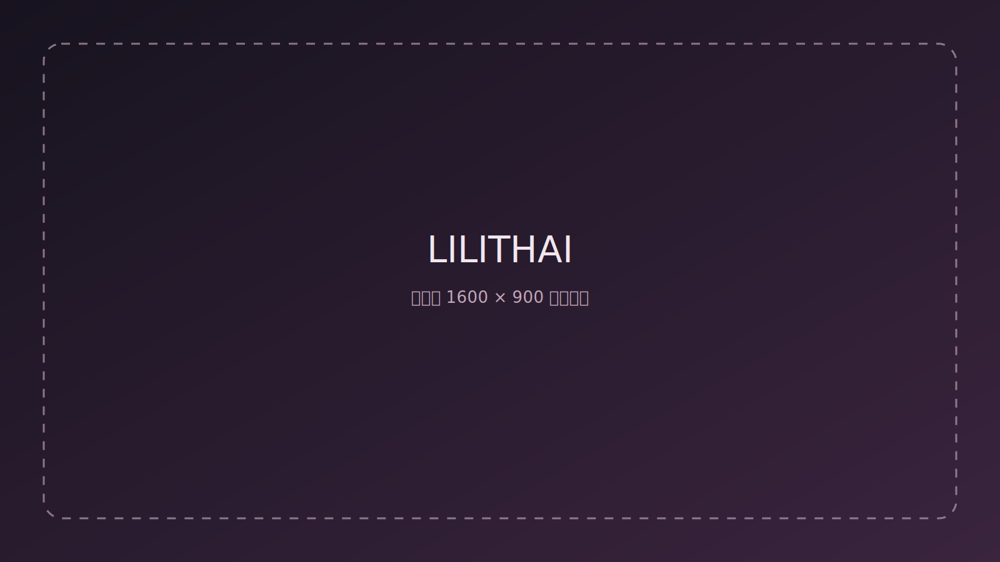
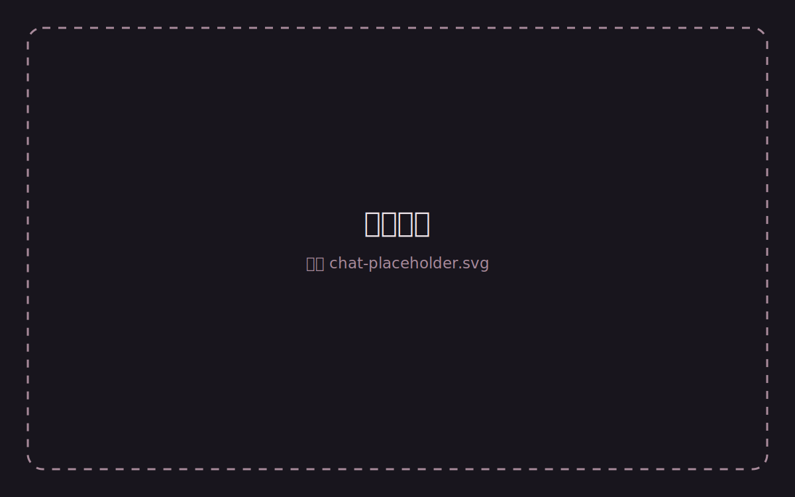
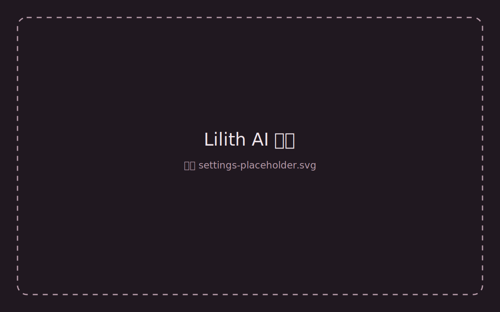

# LilithAI



讓《The NOexistenceN of Lilith》裡的莉莉絲陪你多聊一會。

LilithAI 是 Windows 版的 BepInEx IL2CPP 外掛。它把 AI 對話接進遊戲原本的互動選單，保留最近的談話脈絡，也能讓回覆帶動莉莉絲的表情與動作。你可以使用 OpenAI、Anthropic、Gemini、xAI、DeepSeek、Mistral、OpenRouter，或留在本機的 Ollama、LM Studio。

> 這是非官方模組，與遊戲開發者及發行商無關。請先備份重要存檔。

## 畫面預覽

| 對話 | 設定 |
| --- | --- |
|  |  |

替換 `docs/images/` 內三張同名圖片即可更新 README 展示圖；建議 hero 使用 1600×900，其餘兩張使用 1200×750。

## 下載哪一版

| 版本 | 適合誰 | 內容 |
| --- | --- | --- |
| `LilithAI-vX.Y.Z-text.zip` | 只想聊天、不想跑本機語音 | 外掛本體；不需要額外 GPU 或模型 |
| `LilithAI-vX.Y.Z-voice.zip` | 想讓中文回覆唸出來 | 外掛本體與中文語音安裝器；安裝時另下載約 2 GB runtime |

兩版使用同一個 DLL。純文字版之後也能直接覆蓋成語音版，不會清除設定或對話記憶。

## 安裝

1. 安裝 [BepInEx 6 IL2CPP Windows x64](https://docs.bepinex.dev/master/articles/user_guide/installation/unity_il2cpp.html)，解壓到 `Lilith.exe` 所在資料夾。
2. 啟動遊戲一次，等 BepInEx 完成首次初始化後關閉遊戲。
3. 從 [Releases](../../releases/latest) 下載需要的 LilithAI 版本，直接解壓到 `Lilith.exe` 所在資料夾。
4. 語音版再執行 `Install-Chinese-Voice.cmd`。安裝器會下載、校驗並安裝中文語音 runtime。
5. 進入遊戲設定的 `Lilith AI` 分頁，選擇服務、模型並填入 API key；使用語音版時把語音切換成 `中文`。

更新時只要關閉遊戲，再用新版 ZIP 覆蓋即可。設定保存在 `BepInEx/config/tw.shawn.lilith.ai.cfg`，對話記憶保存在 `BepInEx/data/LilithAI/memory.json`。

## 日文語音

日文動態語音使用 [Irodori TTS Server](https://github.com/Aratako/Irodori-TTS-Server)，模型環境沒有放進發布包。先在 `BepInEx/data/LilithTextInjector/voice-runtime` 完成其 Windows 安裝，再於遊戲設定選擇 `日文`：

```powershell
git clone https://github.com/Aratako/Irodori-TTS-Server.git
Set-Location .\Irodori-TTS-Server
uv sync --extra cu128
Copy-Item .env.example .env
```

中文或日文語音建議使用 8 GB VRAM、16 GB RAM；CPU 可以執行，但等待時間會比較長。語音端點只接受 localhost，參考音檔路徑與自動啟動選項可在設定檔的 `TTS` 區段調整。

## 使用提醒

- API key 只寫入本機 BepInEx 設定檔，不會出現在 LilithAI 的診斷紀錄。
- `BepInEx/LogOutput.log` 會記錄請求、回覆與解析結果，方便除錯，但其中可能包含你的對話；回報問題前請先檢查內容。
- 玩家名稱預設不會傳給模型，可在設定檔的 `Context.IncludePlayerName` 自行開啟。
- 選擇 Ollama 或 LM Studio 時，模型與對話都能留在本機。

## 自行建置

需要 .NET SDK，以及已完成首次啟動的 BepInEx 遊戲目錄：

```powershell
dotnet build .\LilithAI.sln -c Release -p:GameDir="D:\SteamLibrary\steamapps\common\The NOexistenceN of Lilith"
$env:DOTNET_ROLL_FORWARD='Major'
dotnet run --project .\tests\LilithAISmoke.csproj -c Release --no-build
.\scripts\Build-Release.ps1
```

`Build-Release.ps1` 會在 `release-assets/output/` 產生兩個發布 ZIP 與 SHA-256 清單。

## 致謝

- [BepInEx](https://github.com/BepInEx/BepInEx) 提供 Unity IL2CPP 外掛載入環境。
- 中文 GPT-SoVITS runtime 與參考素材來自 [Lilith-AI-Mod](https://github.com/mimimi6666/Lilith-AI-Mod) 的公開發布檔。
- 日文語音由 [Irodori TTS Server](https://github.com/Aratako/Irodori-TTS-Server) 提供。

遊戲名稱、角色與素材版權屬原權利人所有。
